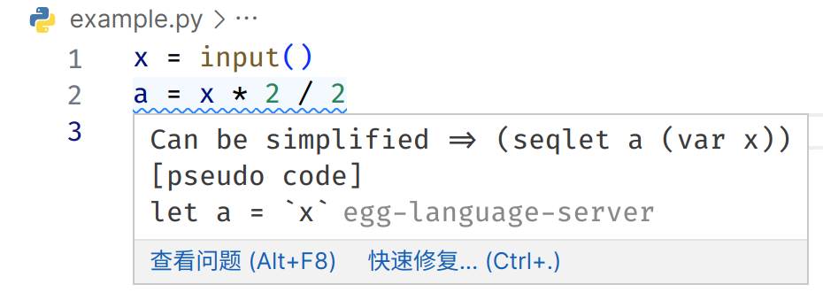

<div align="center">
  
  <h1>egg-language-server</h1>
  <b>🧪 in developing</b><br/>
  <i>Source Code Optimization Tools at Writing-time</i><br/>
</div>

# 介绍 ([English](#egg-language-server-readme))

egg 驱动的编写时代码优化语言服务器及 Visual Studio Code 插件。

本插件更多作为实验性质，真正的易于使用的编写时源码优化有待进一步工作

## 特性



egg-language-server 包括一个语言服务器及一个 Visual Studio Code 插件。目前支持 lisp、python、JavaScript 语言的**子集**，未来预计会支持更多语言。目前，它在 Python 上工作最好

egg-language-server 可以帮助您：

- 优化程序结构，提升代码性能。
- 简化源码本身。
- 提升您的能力和代码质量。

egg 的源码优化主要分为以下过程：

1. Code -> AST：基于 Tree-sitter
2. AST -> IR：针对特定目标语言分别实现的 `ast_to_sexpr`
3. IR <-> IR: 构造基本元素抽象、过程抽象和数据抽象的 `CommonLanguage`。通过 egg 进行 Rewrite。
4. IR -> AST：Common Language 自动派生方法
5. AST -> Code：针对特定目标语言分别实现的 `rpn_to_human`

## 依赖

[egg](https://github.com/egraphs-good/egg): 提供快速可拓展的等式饱和支持

[tower-lsp](https://github.com/ebkalderon/tower-lsp): 提供 LSP 支持

其他参见 `Cargo.toml` 文件

## 设置

此扩展提供以下设置:

- `EgglanguageServer.maxNumberOfProblems`: 
  - 描述：控制最多报告问题的数量
- `EgglanguageServer.ifExplanations`: 
  - 描述：控制 是否显示 egg 重写方案解释
- `EgglanguageServer.ExplanationWithLet`: 
  - 描述：控制 是否显示 egg let 风格的重写方案解释
- `EgglanguageServer.ifEggIR`: 
  - 描述：控制 是否显示egg的中间表示
- `EgglanguageServer.outLanguage`: 
  - 描述：控制 输出的优化结果参考的伪代码语言类型
- `EgglanguageServer.trace.server`: 
  - 描述：跟踪 VS Code 和语言服务器之间的通信

## 开发

对本项目作进一步的开发非常容易

### 结构

```
.
├── client // 语言客户端
│   └── src
│       ├── test // 语言客户端/服务器的端到端测试
│       └── extension.ts // 语言客户端入口点
├── package.json // 扩展清单
└── server // 语言服务器
    └── src
        └── main.rs // 语言服务器入口点
```

### 运行

0. 在此文件夹上打开 VS Code
1. 在此文件夹中运行 `npm install` , 这将在客户端文件夹中安装所有必要的 npm 模块
2. `cargo build`
3. 按下 <kbd>F5</kbd> 或者
   1. 切换到侧栏中的运行和调试视图 (Ctrl+Shift+D).
   2. 从下拉列表中选择 `Run Extension (Debug Build)` (如果尚未默认选择)。
   3. 点击 ▷ 运行启动配置 (F5).


### 基准测试

本插件的性能目标是在常用硬件中对于大部分情况在一秒内给出源码优化提示。

**使用 egg 提供的基准测试方案**

要获取每个测试运行时的简单csv，您可以设置环境变量将 “EGG_BENCH_CSV” 添加到要将每个测试附加到csv的行的内容。

示例:

```bash
EGG_BENCH_CSV=common.csv cargo test --package egg-language-server --lib -- egg_support::common --nocapture --test --test-threads=1
```

**更多测试**

参见 `scripts` 文件夹中的部分基准测试脚本


## 已知问题

许多，比如

- [ ] 快速更正功能未完成

## 发行说明

暂无发行

## 参考

- 本项目同时也是作者的毕业设计。
- 本项目作者对 egg 的论文《Egg: Fast and Extensible Equality Saturation》进行了中文翻译，可以在 [这里](https://www.overleaf.com/read/jhnbztftxwhm) 查看目前翻译的进度。待翻译完成后，会将其放在本项目的 `doc` 文件夹中。 [预览](./doc/asserts/Fast_and_Extensible_Equality_Saturation_zh_cn.pdf)
- 作为本项目的学习基础，作者有以下笔记：
  - [Software-Foundations-Note](https://github.com/framist/Software-Foundations-Note) 
  - [CS61a-Note](https://framist.github.io/2022/12/19/CS61a-Note/)

---

*English*

I am sorry, my English is bad, so almost empty here. :(

# egg-language-server README

## Features

## Requirements

## Extension Settings

## Development

### Structure

```
.
├── client // Language Client
│   └── src
│       ├── test // End to End tests for Language Client / Server
│       └── extension.ts // Language Client entry point
├── package.json // The extension manifest.
└── server // Language Server
    └── src
        └── main.rs // Language Server entry point
```

### Running

0. Open VS Code on this folder.
1. Run `npm install` in this folder. This installs all necessary npm modules in both the client and server folder
2. `cargo build`
3. press <kbd>F5</kbd> or 
   1. Switch to the Run and Debug View in the Sidebar (Ctrl+Shift+D).
   2. Select `Launch Client` from the drop down (if it is not already).
   3. Press ▷ to run the launch config (F5).

### benchmark

The performance goal of this plugin is to give source code optimization tips within one second for most cases on common hardware.

**Use the benchmark solution provided by egg**

To get a simple csv of each test run, you can set the environment variable "EGG_BENCH_CSV" to add the content of "EGG_BENCH_CSV" to each line to be attached to the csv.

Example:

```bash
EGG_BENCH_CSV=common.csv cargo test --package egg-language-server --lib -- egg_support::common --nocapture --test --test-threads=1
```

**More tests**

See the section of the benchmark test script in the `scripts` folder.

## Known Issues

## Release Notes

## References

---

⚡ Visitor count


