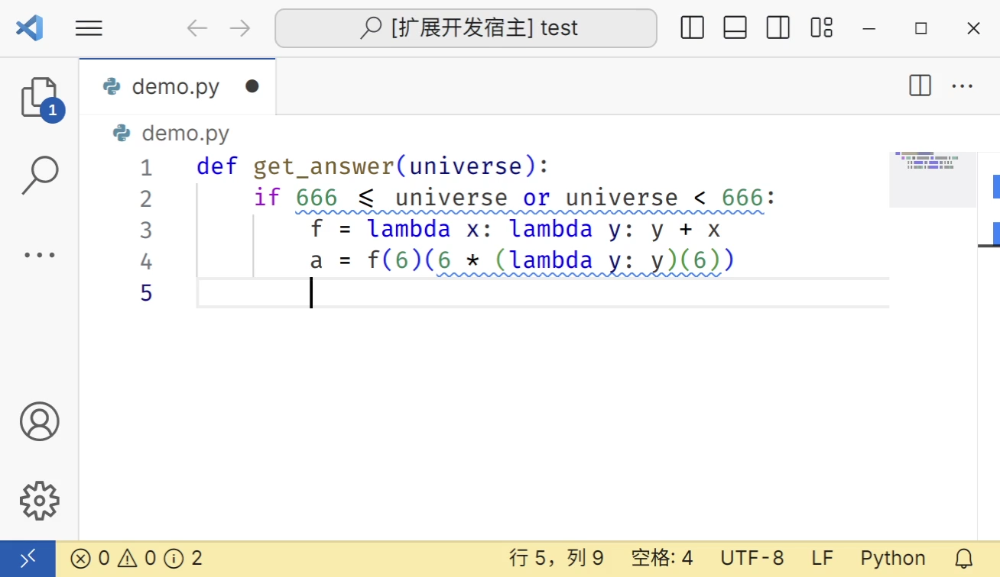

<div align="center">
  
  <h1>egg-language-server</h1>
  <b>🧪 in developing</b><br/>
  <i>Source Code Optimization Tools at Writing-time</i><br/>
</div>

# 介绍 ([English](#egg-language-server-readme))

[egg](https://egraphs-good.github.io/) 驱动的编写时代码优化语言服务器及 Visual Studio Code 插件。

本插件更多作为实验性质，真正的易于使用的编写时源码优化有待进一步工作。

## 特性

[](https://www.bilibili.com/video/BV1MN411z7WU)

egg-language-server 包括一个语言服务器及一个 Visual Studio Code 插件。它是一个在代码编写时环境的代码静态分析工具，借助 [egg](https://egraphs-good.github.io/) 从逻辑层面化简源码，能交互式地提供优化指导。目前支持 lisp、Python、JavaScript 语言的**子集**，未来预计会支持更多语言。目前，它在 Python 上工作最好。

egg-language-server 可以帮助您：

- 优化程序结构，提升代码性能。
- 简化源码本身。
- 提升您的能力和代码质量。

egg 的源码优化主要分为以下过程：

1. Code -> AST：基于 Tree-sitter
2. AST -> IR：针对特定目标语言分别实现的 `ast_to_sexpr`
3. IR <-> IR: 构造基本元素抽象、过程抽象和数据抽象的 `CommonLanguage`。通过 egg 进行 Rewrite。
4. IR -> AST：Common Language 自动派生方法
5. AST -> Code：针对特定目标语言分别实现的 `rpn_to_human`

原理、方案、实现、测试 详见 [Slide](./doc/slide.pdf)

## 快速开始

1. 打开 VS Code
2. 安装 [egg-language-server](https://marketplace.visualstudio.com/items?itemName=framist.egg-language-server) 插件

<details>
<summary>试一试 demo！</summary>
<pre><code>
def get_answer(universe):
    if 666 <= universe or universe < 666:
        f = lambda x: lambda y: y + x
        a = f(6)(6 * (lambda y: y)(6))
        print(a)
</code></pre>
</details>


## 依赖

[egg](https://github.com/egraphs-good/egg): 提供快速可拓展的等式饱和支持

[tower-lsp](https://github.com/ebkalderon/tower-lsp): 提供 LSP 支持

其他参见 `Cargo.toml` 文件

## 设置

此扩展提供的主要设置有：

- `EgglanguageServer.maxNumberOfProblems`: 
  - 描述：控制最多报告问题的数量
- `EgglanguageServer.ifExplanations`: 
  - 描述：控制 是否显示 egg 重写方案解释
- `EgglanguageServer.ExplanationWithLet`: 
  - 描述：控制 是否显示 egg let 风格的重写方案解释
- `EgglanguageServer.ifEggIR`: 
  - 描述：控制 是否显示 egg 的中间表示
- `EgglanguageServer.outLanguage`: 
  - 描述：控制 输出的优化结果参考的伪代码语言类型
- `EgglanguageServer.trace.server`: 
  - 描述：设置 VS Code 和语言服务器之间的通信日志

## 开发

对本项目作进一步的开发非常容易

### 结构

```
.
├── client // 语言客户端
│   └── src
│       ├── test // 语言客户端/服务器的端到端测试
│       └── extension.ts // 语言客户端入口点
├── package.json // 扩展清单
└── server // 语言服务器
    └── src
        └── main.rs // 语言服务器入口点
```

### 运行调试

0. 在此文件夹上打开 VS Code
1. 在此文件夹中运行 `npm install` , 这将在客户端文件夹中安装所有必要的 npm 模块
2. `cargo build`
3. 按下 <kbd>F5</kbd> 或者
   1. 切换到侧栏中的运行和调试视图 (Ctrl+Shift+D).
   2. 从下拉列表中选择 `Run Extension (Debug Build)` (如果尚未默认选择)。
   3. 点击 ▷ 运行启动配置 (F5).


### 基准测试

本插件的性能目标是在常用硬件中对于大部分情况在一秒内给出源码优化提示。

**使用 egg 提供的基准测试方案**

要获取每个测试运行时的简单 csv，您可以设置环境变量将“EGG_BENCH_CSV”添加到要将每个测试附加到 csv 的行的内容。

示例：

```bash
EGG_BENCH_CSV=common.csv cargo test --package egg-language-server --lib -- egg_support::common --nocapture --test --test-threads=1
```

**更多测试**

参见 `scripts` 文件夹中的部分基准测试脚本

### 跨平台 & CI & CD

采用 GitHub Actions 进行，参见 `.github/workflows` 文件夹。

<!-- - push 会自动进行构建 -->
- push tag 会自动构建、发布
- pull request 会自动进行构建、测试

目前支持的平台有：

Windows x64, Windows ia32, Alpine Linux 64 bit, macOS Apple Silicon, macOS Intel, Windows ARM, Linux x64, Linux ARM64, Linux ARM32


## 已知问题

许多，例如

- [ ] 支持语言语法种类过少
- [ ] 输出的人类可读代码可能会违背直觉，特别地在 Python 中可能因缩进问题导致语法错误
- [ ] 大文件的性能问题
- [ ] 用户可调粒度控制
- [ ] 用户自定义规则添加，与社区规则发展

目前此插件仅为一个适应与通用语言的实验性工具。为了提升可用性，后续预计会分叉成针对不同语言的版本，如 `eggLS-Python` 等。

## 发行说明

目前可以在 [Visual Studio Marketplace](https://marketplace.visualstudio.com/items?itemName=framist.egg-language-server) 上找到此扩展。

## 参考

- 本项目同时也是作者的毕业设计。
  - [Slide](./doc/slide.pdf)
- 本项目作者对 egg 的论文《Egg: Fast and Extensible Equality Saturation》进行了中文翻译
  - [PDF](./doc/Fast_and_Extensible_Equality_Saturation_zh_cn.pdf)
  - [源码](./doc/Fast_and_Extensible_Equality_Saturation_zh_cn/)
- 作为本项目的学习基础，作者有以下粗糙的笔记：
  - [Software-Foundations-Note](https://github.com/framist/Software-Foundations-Note) 
  - [CS61a-Note](https://framist.github.io/2022/12/19/CS61a-Note/)
- Videos
  - [用蛋消灭魔鬼！编写时源码优化 VSCode 插件演示 - bilibili](https://www.bilibili.com/video/BV1MN411z7WU)
- 相似产品
  - [sourcery](https://github.com/sourcery-ai/sourcery-vscode.git)


---

*English*

I am sorry, my English is bad, so almost empty here. :(

# egg-language-server README

[Egg](https://egraphs-good.github.io/)-powered code optimization language server and Visual Studio Code plugin.

This plugin serves more as an experimental project, and further work is needed to make it a truly user-friendly code optimization tool.

## Features


egg-language-server includes a language server and a Visual Studio Code plugin. Currently, it supports subsets of the Lisp, Python, and JavaScript languages, with plans to support more languages in the future. It works best with Python.

egg-language-server can help you:
- Optimize program structure and improve code performance.
- Simplify the source code itself.
- Enhance your skills and code quality.

The source code optimization in egg mainly consists of the following processes:
1. Code -> AST: Based on Tree-sitter.
2. AST -> IR: Implementation of `ast_to_sexpr` for each specific target language.
3. IR <-> IR: Constructing a `CommonLanguage` that abstracts basic elements, procedure abstractions, and data abstractions through rewriting in egg.
4. IR -> AST: Automatic derivation of methods for the Common Language to convert back to an Abstract Syntax Tree.
5. AST -> Code: Implementation of `rpn_to_human` for each specific target language.

more in [Slide (zh-Hans)](./doc/slide.pdf)

## Quick Start

1. Open VS Code
2. Install the [egg-language-server](https://marketplace.visualstudio.com/items?itemName=framist.egg-language-server) extension
3. enjoy it!

<details>
<summary>try demo!</summary>
<pre><code>
def get_answer(universe):
    if 666 <= universe or universe < 666:
        f = lambda x: lambda y: y + x
        a = f(6)(6 * (lambda y: y)(6))
        print(a)
</code></pre>
</details>


## Requirements

## Extension Settings

## Development

### Structure

```
.
├── client // Language Client
│   └── src
│       ├── test // End to End tests for Language Client / Server
│       └── extension.ts // Language Client entry point
├── package.json // The extension manifest.
└── server // Language Server
    └── src
        └── main.rs // Language Server entry point
```

### Debugging

0. Open VS Code on this folder.
1. Run `npm install` in this folder. This installs all necessary npm modules in both the client and server folder
2. `cargo build`
3. press <kbd>F5</kbd> or 
   1. Switch to the Run and Debug View in the Sidebar (Ctrl+Shift+D).
   2. Select `Launch Client` from the drop down (if it is not already).
   3. Press ▷ to run the launch config (F5).

### benchmark

The performance goal of this plugin is to give source code optimization tips within one second for most cases on common hardware.

**Use the benchmark solution provided by egg**

To get a simple csv of each test run, you can set the environment variable "EGG_BENCH_CSV" to add the content of "EGG_BENCH_CSV" to each line to be attached to the csv.

Example:

```bash
EGG_BENCH_CSV=common.csv cargo test --package egg-language-server --lib -- egg_support::common --nocapture --test --test-threads=1
```

**More tests**

See the section of the benchmark test script in the `scripts` folder.

## Known Issues

## Release Notes

## References

